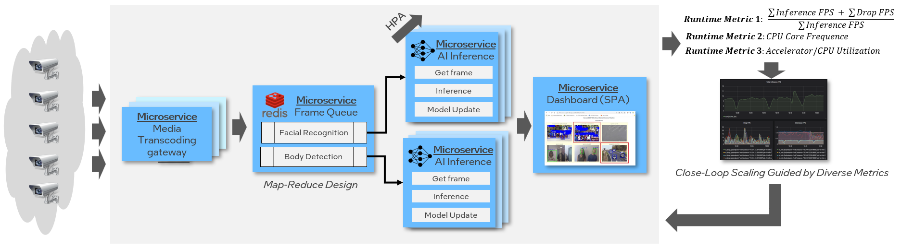
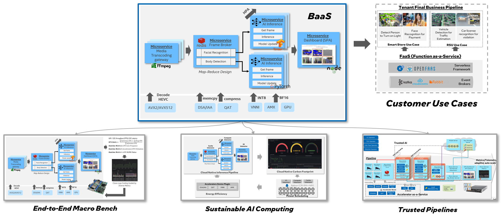

# Cloud Native AI Pipeline


## 1. Overview

This project provides a multiple-stream, real-time inference pipeline based on cloud native design pattern as following architecture
diagram:



Cloud-native technologies can be applied to Artificial Intelligence (AI) for scalable application in dynamic environments
such as public, private and hybrid cloud. But it requires a cloud native design to decompose monolithic inference pipeline
into several microservices:

| Microservice | Role | Description  |
| ------------ | ---- | ----------- |
| Transcoding Gateway | Data Source | Receive multiple streams and perform transcoding |
| Frame Queue | Data Integration | Assign the input stream into specific work queue |
| Infer Engine | Data Analytics | Infer the frame and send result to result broker |
| Dashboard | Data Visualization | Render the result into client's single page application |

## 2. Uses

It is extended for the following uses:

- `End-to-End Macro Bench Framework` for cloud native pipeline like DeathStar Bench
- `Trusted AI pipeline` to protect input stream or model in TEE VM/Container
- `Sustainable AI computing` to reduce carbon footprint for AI workloads



## 3. Building

The provided [build script](tools/docker_image_manager.sh) simplifies the process of building Docker images for our microservices. For instance, to build all Docker images, use the following command:

```bash
./tools/docker_image_manager.sh -a build -r <your-registry>
```

The `-a` argument specifies the action(either `build`, `publish`, `save` or `all`), and `-r` is the prefix string for your docker registry

You can get more detail options and arguments for `docker_image_manager.sh` via `./tools/docker_image_manager.sh -h`

The Dockerfile is under the directories in [container](container/)

## 4. Deployment

We deliver the helm chart for deployment. After you **finish** building the images and upload to your registry, you need to update the helm chart values `image.repository` to your registry and `image.tag` to your build tag, which defined in each helm chart. Then, assume you navigate to the project's root directory, you can use the following options to install the helm chart:

### Deploy with the helm manager

1. Navigate to the project's root directory.

2. Execute the Helm manager script with the appropriate arguments. For instance, to install all Helm charts, use the following command:

   ```bash
   ./tools/helm_manager.sh -i
   # To uninstall all charts
   # ./tools/helm_manager.sh -u
   ```

   The `-i` argument triggers the installation of Helm charts.

   You can also specify a specific chart to install or uninstall using the chart name as an argument. For instance:

   ```bash
   ./tools/helm_manager.sh -i <chart_name>
   ./tools/helm_manager.sh -u <chart_name>
   ```

   Use `-l` to list all available charts and `-h` to display help information.

Please refer to the [script](./tools/helm_manager.sh) source code for more detailed information on how they work and the full range of available options.

### Deploy with the helm command

1. Navigate to the project's root directory.

2. Execute the Helm manager script with the appropriate arguments. For instance, to install all Helm charts, use the following command:

    ```bash
    # helm install <customer-release-name> <helm-chart-directory>

    # Redis service
    helm install redis ./helm/redis
    # Optional, if you want to see the redis dashboard in grafana: helm install redis-exporter ./helm/redis-exporter

    # Inference service
    helm install inference ./helm/inference

    # SPA service
    helm install pipelineapi ./helm/pipelineapi
    helm install websocket ./helm/websocket
    helm install ui ./helm/ui

    # Steam service
    helm install stream ./helm/stream
    ```

The dashboard of CNAP will be available at `http://<your-ip>:31002`, it is exposed as a NodePort service in kubernetes.

**Note**: This is pre-release/prototype software and, as such, it may be substantially modified as updated versions are made available.
