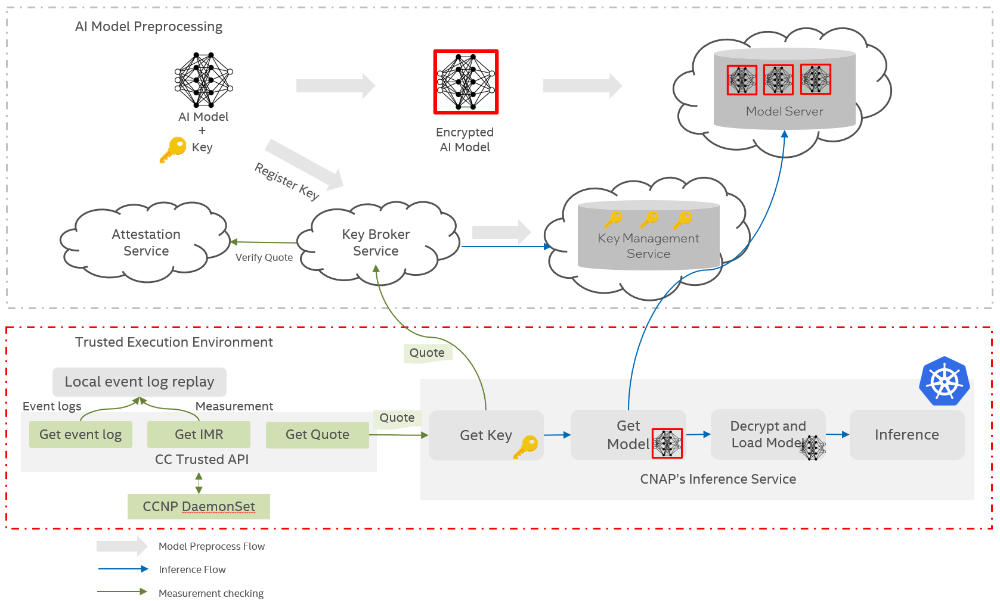

# How to Protect AI Models in Cloud Native Environments

In the age of digital transformation, cloud native AI is becoming increasingly important for businesses. By leveraging cloud infrastructure for artificial intelligence (AI), organizations can benefit from greater scalability, cost savings, and access to cutting-edge technology. As organizations move more of their AI workloads to the cloud, their need to secure their data and AI models has become increasingly important. With the potential for malicious actors to gain access to sensitive systems, organizations must ensure that their cloud native AI architectures are adequately protected.

AI models often rely on large and sensitive datasets for training, and both the AI models and datasets should be considered valuable intellectual property. Protecting the AI models is essential to prevent data breaches and unauthorized access to sensitive information.

**Confidential Computing** is a set of technologies designed to protect data in use, for example using memory encryption, attestation. While data at rest (on disk) and data in transit (over the network) can already be protected using existing technologies, for example encryption algorithms (such as AES-GCM) can ensure the confidentiality and integrity of data, but after AI model is loaded in computing memory and decrypted, it has to use confidential computing to protect the AI models in use.

To ensure the cloud native environments and AI models are secure protected in use, this document describes a design and implementation to enhance the trustworthy by leveraging Intel’s Trusted Execution Environment (TEE), Confidential Cloud-Native Primitives (CCNP) and attestation which play a central role in asserting that confidential systems are indeeded confidential.

## 1. Architecture Design

This design can be divided into three steps logically.
- A plain AI model is preprocessed before uploading or use in cloud native environment. AI model should be encrypted offline, and the encryption key will be stored in a key database server.
- Attestation of the cloud native environment.  Attestation is a confidential computing keystone. With attestation, AI models owner can fully assert the trustworthiness of the hardware and software environment AI is running in, regardless of the security posture of the underlying infrastructure provider.
- AI Model fetching and decryption. Before CNAP can start its AI pipeline streaming inference, a proper AI model has to be downloaded then decrypted.



### 1.1 AI Model Preprocessing

To protect the model and its encryption key, the following preprocessing steps are taken:

- Generate a key, a AES GCM key can be used for confidentiality and integrity.
- Encrypt AI model by the key.
- Upload the encrypted model to Model Server.
- Register key to Key Broker Service (KBS), and KBS will communicate with Key Management Service (KMS) to store the key in its database.

### 1.2 Attestation by using Confidential Cloud-Native Primitives (CCNP)

[CCNP](https://github.com/intel/confidential-cloud-native-primitives) is to enable Intel Trust Domain Extensions (TDX) or other TEE technologies and simplify the usage of TEE in cloud native environment. It comprises two main components: the services and the SDK, which includes event log, measurement, quote generation and other APIs.

- Service is designed to hide the complexity of different TEE platforms and provides common interfaces and scalability for cloud native environment.

- SDK is to simplify the use of the service interface for development, it communicates to the service and parses the return results from the services.

The service supports attestation, measurement fetching and event log collecting of various platforms including Intel TDX, Trusted Platform Modules (TPM) and AMD Secure Encrypted Virtualization-Secure Nested Paging (SEV-SNP) (will be supported soon).

To get the key to decrypt the model, we need provide the quote of TEE for attestation, CCNP is a good choice to get the quote and it hides the complexity and is easy to use, sample code from CCNP:

```Python
from ccnp import Quote
quote=Quote.get_quote()
```

CCNP API detail documentation can be found [here](https://intel.github.io/confidential-cloud-native-primitives/).

### 1.3 AI Model Decryption

CNAP project’s Inference Service flow of getting AI model should be updated to support TEE environment since the AI model has been encrypted:

- Deploy CCNP as a [DaemonSet](https://intel.github.io/confidential-cloud-native-primitives/_rst/service.quote.html#deploy-as-daemonset-in-kubernetes), it will detect the TEE environment.
- Get the quote and request the key from KBS.
- Download the encrypted AI model from Model Server.
- Decrypt AI model and load the model in memory to start AI streaming inference.

## 2. Implementation Details

Current Cloud-Native AI Pipeline (CNAP) project already implements the new design to protect sample AI Models in cloud native environment. This section will describe the details of each components and introduce how to enable a new AI model server or KBS interface in customer's environment.

To protect AI model, the first thing is to generate a key for model encryption, encrypt the model and register the key to KBS. Then KBS will submit further request to store the key to KMS.

To fetch and decrypt the model, the runtime environment should be verified by attestation. A key broker client should get a quote and send the quote to KBS to verify that it is running on an authentic TEE platform. Upon successful attestation, KBS will then respond with a wrapped key for AI model's decryption later.

### 2.1 AI Model Encryption

AES-GCM is a widely used block cipher mode of operation for securing data, particularly in network communications (data in transit) and data storage (data at reset). It combines two important cryptographic techniques: Advanced Encryption Standard (AES) and Galois/Counter Mode (GCM). AES is a symmetric encryption algorithm that uses a shared secret key for both encryption and decryption. GCM is based on a combination of CTR and GMAC, this combination ensures that not only the data is encrypted, but also it includes an authentication tag that allows the recipient to verify the integrity of the data.

The key features and benefits of AES GCM include confidentiality, data integrity and authentication. The Initialization Vector (IV) is a random value used as an input alongside the encryption key to initialize the encryption process, and the authentication tag is a small piece of data generated during encryption and appended to the ciphertext.

Typically, the AES-256-GCM encrypted data format should be:

12 bytes header | [12] bytes IV | encrypted data | [16] bytes tag
---|---|---|---

and the 12 bytes header:

uint32 IV length | uint32 tag length | uint32 data length
---|---|---

Some sample code for encryption:

```Python
import secrets
import struct
from cryptography.hazmat.primitives.ciphers.aead import AESGCM

def encrypt_file(input, output, key):
    with open(args.input, 'rb') as infile:
        data = infile.read()
        aesgcm = AESGCM(key)
        IV = secrets.token_bytes(12)
        data_enc = aesgcm.encrypt(IV, data, None)
        with open(output, 'wb') as outfile:
            header = struct.pack('<3I', len(IV), 16, len(data_enc))
            outfile.write(header)
            outfile.write(IV)
            outfile.write(data_enc)
```

### 2.2 Key Registration

After encrypting the AI model, the key should be registered with KBS. The KBS should handle the attestation process for a client to retrieve the key.
A typical flow of key registration:

- Connect to the KBS with authentication information to get a token.
- Create the key transfer policy with the token, the policy should include the attestation type and attestation polices.
- Register the key with the key transfer policy ID and the token.

### 2.3 AI Model Server

An [abstract class](https://github.com/intel/cloud-native-ai-pipeline/blob/main/cnap/core/modelprovider.py) `ModelProvider` is introduced in CNAP project, it includes the common interface of getting the model information from Model Server (Service). The `SimpleModelProvider` is an implementation of `ModelProvider`, which shows an example to get a model from the Model Server.

A sample Model Server includes an interface to get the model information, such as id, framework, model URL, KBS URL etc. Here is an example used in CNAP project:

- Request

```Python
# HTTP Headers
headers = {
            "Accept": "application/json",
            "Content-Type": "application/json"
}
# Request URL
req_url = http://{model_info_url}/{model_id}
```

- Response

```JSON
{
    "id": "c8b019e0-f4d8-4831-8936-f7f64ad99509",
    "framework": "tensorflow",
    "target": "object-detection",
    "url": "http://{model_server_url}/tensorflow/ssdmobilenet_v10.pb.enc",
    "name": "ssdmobilenet",
    "version": "1.0",
    "dtype": "int8",
    "encrypted": true,
    "kbs": "simple_kbs",
    "kbs_url": "https://{key_brocker_server_url}",
    "key_id": "88b3a4b3-ba4b-4e2b-b00e-bc32ca3d56be"
}
```

A model provider should be implemented to get models information and download the model from model URL, if the model is encrypted, then invoke the key broker client to get the key from the KBS and decrypt the model.

### 2.4 Key Broker Service

An [abstract class](https://github.com/intel/cloud-native-ai-pipeline/blob/main/cnap/core/keybroker.py) `KeyBrokerClientBase` is introduced in CNAP project, and it has an abstract method `get_key` to get a user key from Key Broker Service (KBS). For a new KBS, a key broker client should be implemented to connect to KBS and get the key. `SimpleKeyBrokerClient` is an example to get a key from a simple KBS.

An sample working flow of a simple KBS implementation:

- Accept a quote and a public key from client.
- Verify the quote and do attestation, return the verification status.
- Get the user key from key management server (KMS), generate a symmetric wrapping
    key (SWK) to encrypt the user key (wrapped_key).
- Encrypt the SWK by the public key from client (wrapped_swk).

For a key broker client, here is an example working flow of key broker client to get a key from KBS:

- Generate 2048 bit RSA key pair (a public key and a private key).
- Encode the public key to base64 for transferring (user_data).
- Get quote in the TEE with the hash of the public key for measurement (quote).
- Request wrapped_key and wrapped_swk from KBS with quote and user_data.
- Decrypt the user key by the SWK.

A sample interface of key broker client to communicate with KBS:

- Request

```Python
# HTTP Headers
headers = {
    "Accept": "application/json",
    "Content-Type": "application/json",
    "Attestation-Type": "TDX"
}
# HTTP Body
req_body = {
    "quote": quote,
    "user_data": user_data
}
```

- Response

```JSON
{
    "wrapped_key":"",
    "wrapped_swk":""
}
```

### 2.5 Attestation

CCNP provides an easy way to get the quote for attestation in TEE. Before getting the quote, a RSA key pair need to be generated for wrapping purpose and the public key will be measured as the user data input to the quote fetching process.

The public key is carried as an parameter to the get_quote() function while fetching the user key. After verifying the integrity of the public key passed along with the quote, KBS will use it to encrypt the SWK.

The sample code to get the quote with user data:

```Python
import base64

from ccnp import Quote
from cryptography.hazmat.primitives.asymmetric import rsa

private_key = rsa.generate_private_key(public_exponent=65537, key_size=3072)
pubkey = private_key.public_key()
pubkey_der = pubkey.public_bytes(encoding=serialization.Encoding.DER,
                                 format=serialization.PublicFormat.SubjectPublicKeyInfo)
user_data = base64.b64encode(pubkey_der).decode('utf-8')
quote = Quote.get_quote(user_data=user_data)
```

### 2.6 AI Model Decryption

Just like the encryption, the AES-256-GCM encrypted data format should be:

12 bytes header | [12] bytes IV | encrypted data | [16] bytes tag
---|---|---|---

and the 12 bytes header:

uint32 IV length | uint32 tag length | uint32 data length
---|---|---

To decrypt the data, here are some sample code:

```

from cryptography.hazmat.primitives.ciphers import Cipher, algorithms, modes

def decrypt_data(encrypted_data, key) -> bytes:

    if encrypted_data is None or key is None:
        raise ValueError("Encrypted data or key is empty")

    header_len = 12
    iv_len, tag_len, data_len = struct.unpack('<3I', encrypted_data[:header_len])
    iv = encrypted_data[header_len : (iv_len + header_len)]
    data = encrypted_data[(iv_len + header_len) : -tag_len]
    tag = encrypted_data[-tag_len:]

    decryptor = Cipher(algorithms.AES(key), modes.GCM(iv, tag)).decryptor()
    decrypted_data = decryptor.update(data) + decryptor.finalize()
    return decrypted_data
```

## Conclusion

As organizations move more of their AI workloads to the cloud, AI models security, and protection has become more important. Confidential computing provides a set of technologies designed to protect data in use, such as AI models currently being processed by the machine, or currently in memory. 
This document describes a common architecture to “design and run” a native AI Model into confidential computing environments. (1) AI Model preprocess (2) Attestation of the cloud native environment (3) AI Model fetching and decryption.
Intel’s TDX technology can provide a TEE running environment, and CCNP can simply the attestation of confidential native environment, last but not least, a sample KBS is introduced to help customer to connect with its own or vendor-independent attestation service (for example, Intel Trust Authority).

# References

1. Model Provider: https://github.com/intel/cloud-native-ai-pipeline/blob/main/cnap/core/modelprovider.py
2. Key Broker Client: https://github.com/intel/cloud-native-ai-pipeline/blob/main/cnap/core/keybroker.py
3. CCNP: https://github.com/intel/confidential-cloud-native-primitives
